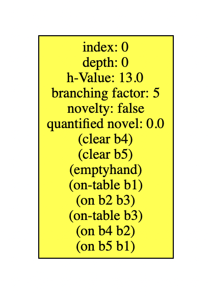
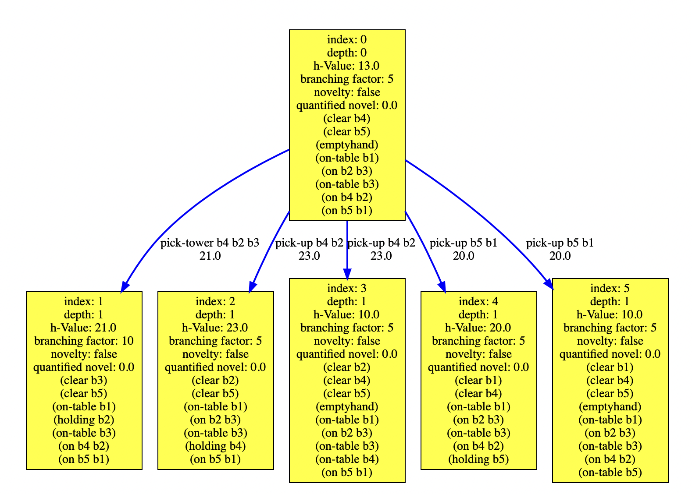
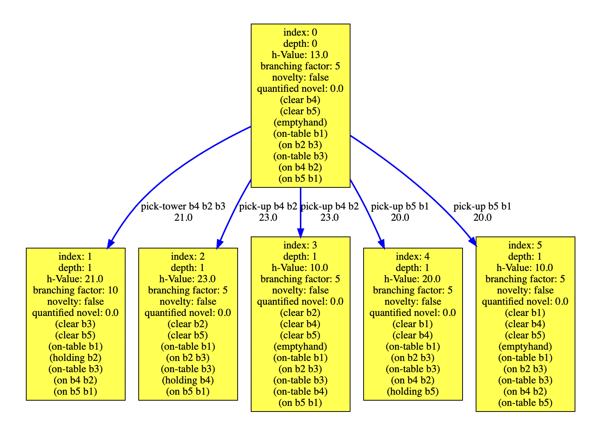
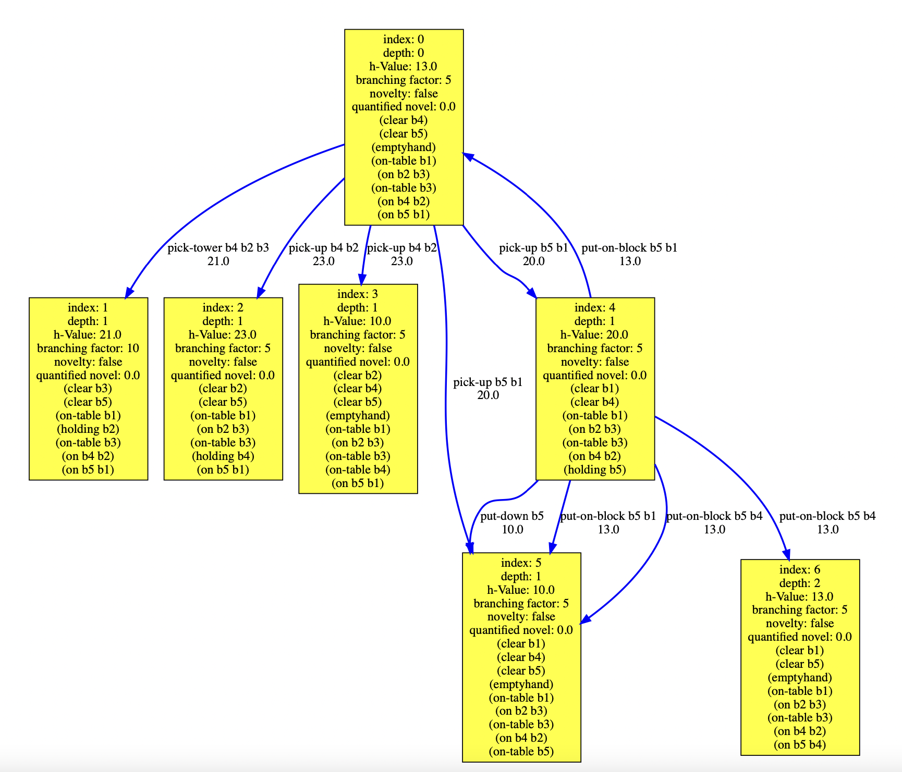
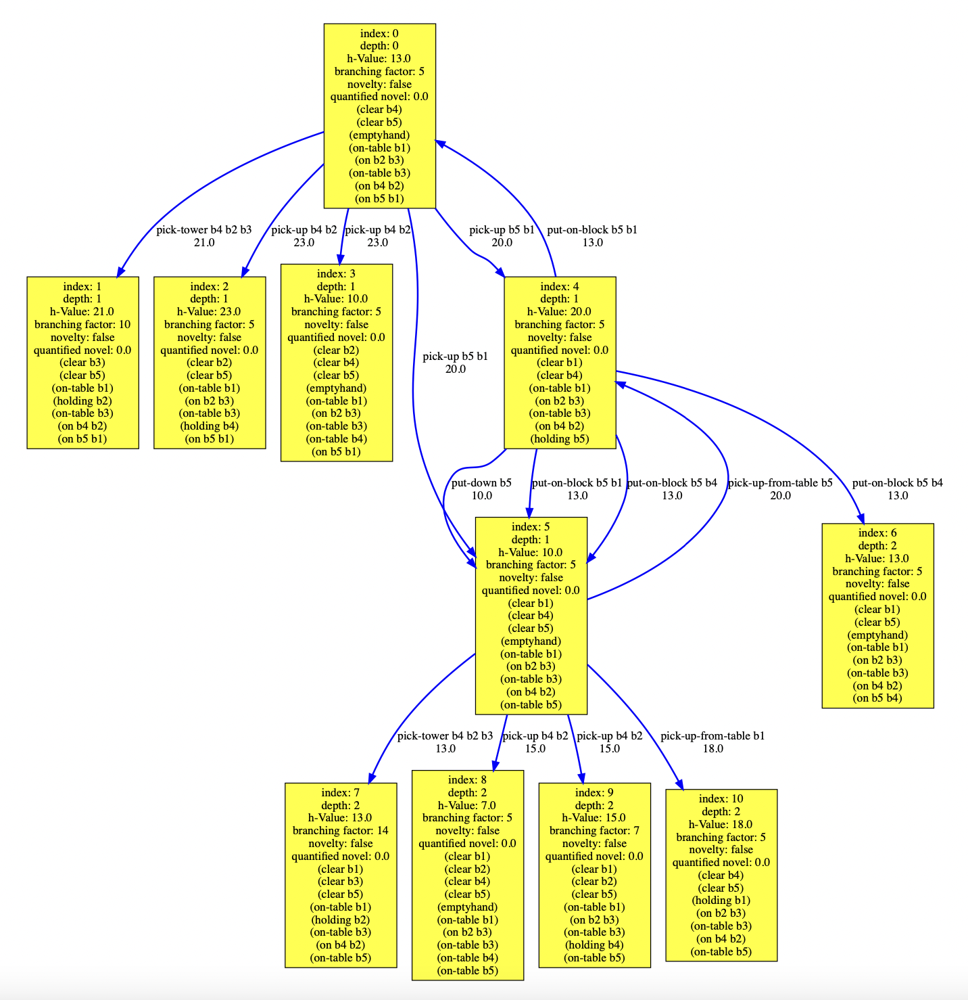
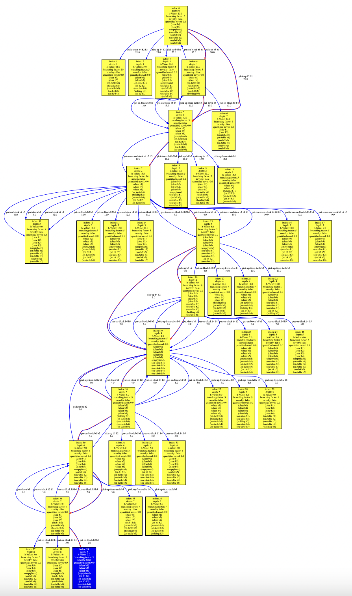

# Paladinus: Debug

Paladinus provides a state-space debugger that shows the expanded states for every iteration of our algorithms.
Our state-space debugger outputs a DOT file for every state expansion during the search.

For every iteration step, we our state-space debugger outputs the expanded states and their corresponding state-space.
A DOT file corresponds to a state-space in an iteration step. 
For example:

```bash

- iteration\_1-statespace\_0;
- iteration\_1-statespace\_1;

- iteration\_2-statespace\_0;
- iteration\_2-statespace\_1;
- iteration\_2-statespace\_2;

...
```

## State-spaces explored for Blocks-World-Original pb10.pddl:

### iteration\_1-statespace\_0:



### iteration\_2-statespace\_0:



### iteration\_2-statespace\_1:



### iteration\_2-statespace\_2:



### iteration\_2-statespace\_3:



### ...

### iteration\_2-statespace\_17.dot:



### All State-spaces for pb10.pddl

You can find [here](docs/bw-ori-p10) the entire set of state-spaces for pb10.pddl.