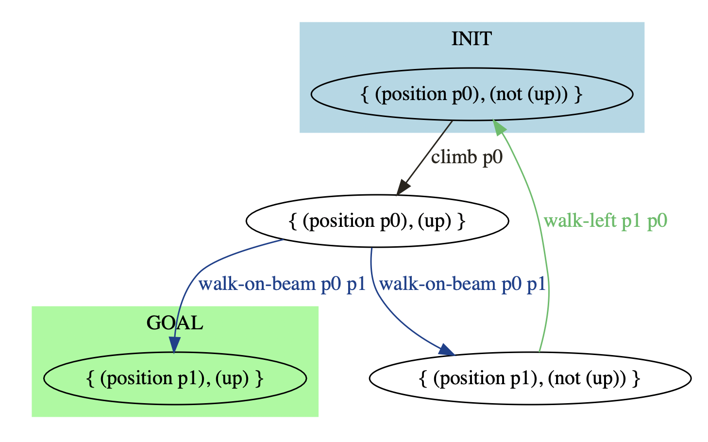
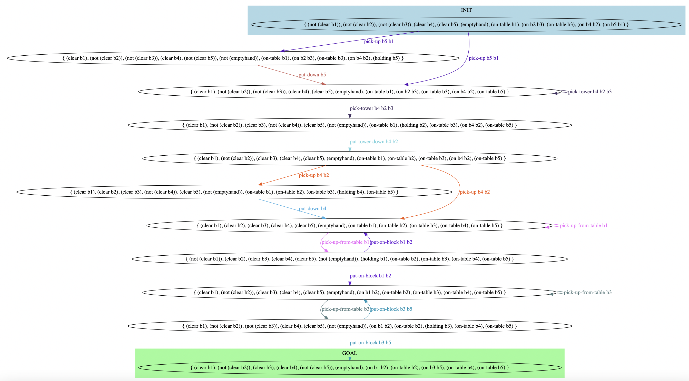

# Paladinus: Policy Output and Visualization

Paladinus outputs a policy when one exists for FOND planning task.
We provide two types of outputs: 
- A text file (policy.txt), containing the output policy that maps states into actions; and 
- A graph visualization for the output policy (policy.dot);

## Policy as Text

We now provide some examples of how we represent FOND Planning policies as text.

### Acrobatics: p0.pddl

The policy output text file for this example is [policy-acrobatics_p0.txt](docs/policy-acrobatics_p0.txt).

```bash
If holds: (position p0), (up)
Execute: walk-on-beam p0 p1

If holds: (position p0), (not (up))
Execute: climb p0

If holds: (position p1), (not (up))
Execute: walk-left p1 p0
```

### Blocks-World-Original: p10.pddl

The policy output text file for this example is [policy-bw-ori-p10.txt](docs/policy-bw-ori-p10.txt).

```bash
If holds: (clear b1), (clear b2), (clear b3), (not (clear b4)), (clear b5), (not (emptyhand)), (on-table b1), (on-table b2), (on-table b3), (holding b4), (on-table b5)
Execute: put-down b4

If holds: (clear b1), (not (clear b2)), (not (clear b3)), (clear b4), (not (clear b5)), (not (emptyhand)), (on-table b1), (on b2 b3), (on-table b3), (on b4 b2), (holding b5)
Execute: put-down b5

If holds: (not (clear b1)), (not (clear b2)), (not (clear b3)), (clear b4), (clear b5), (emptyhand), (on-table b1), (on b2 b3), (on-table b3), (on b4 b2), (on b5 b1)
Execute: pick-up b5 b1

If holds: (clear b1), (not (clear b2)), (not (clear b3)), (clear b4), (clear b5), (emptyhand), (on-table b1), (on b2 b3), (on-table b3), (on b4 b2), (on-table b5)
Execute: pick-tower b4 b2 b3

If holds: (clear b1), (not (clear b2)), (clear b3), (not (clear b4)), (clear b5), (not (emptyhand)), (on-table b1), (holding b2), (on-table b3), (on b4 b2), (on-table b5)
Execute: put-tower-down b4 b2

If holds: (clear b1), (not (clear b2)), (not (clear b3)), (clear b4), (clear b5), (not (emptyhand)), (on b1 b2), (on-table b2), (holding b3), (on-table b4), (on-table b5)
Execute: put-on-block b3 b5

If holds: (not (clear b1)), (clear b2), (clear b3), (clear b4), (clear b5), (not (emptyhand)), (holding b1), (on-table b2), (on-table b3), (on-table b4), (on-table b5)
Execute: put-on-block b1 b2

If holds: (clear b1), (not (clear b2)), (clear b3), (clear b4), (clear b5), (emptyhand), (on b1 b2), (on-table b2), (on-table b3), (on-table b4), (on-table b5)
Execute: pick-up-from-table b3

If holds: (clear b1), (not (clear b2)), (clear b3), (clear b4), (clear b5), (emptyhand), (on-table b1), (on-table b2), (on-table b3), (on b4 b2), (on-table b5)
Execute: pick-up b4 b2

If holds: (clear b1), (clear b2), (clear b3), (clear b4), (clear b5), (emptyhand), (on-table b1), (on-table b2), (on-table b3), (on-table b4), (on-table b5)
Execute: pick-up-from-table b1
```

## Policy (Graph) Visualization

We now provide some examples of how we represent FOND Planning policies as graphs using GraphViz (.DOT files).

### DOT file Acrobatics: p0.pddl

The DOT file for this example is [policy-acrobatics_p0.dot](docs/policy-acrobatics_p0.dot).



### DOT file for Blocks-World-Original: p10.pddl

The DOT file for this example is [policy-bw-ori-p10.dot](docs/policy-bw-ori-p10.dot).


